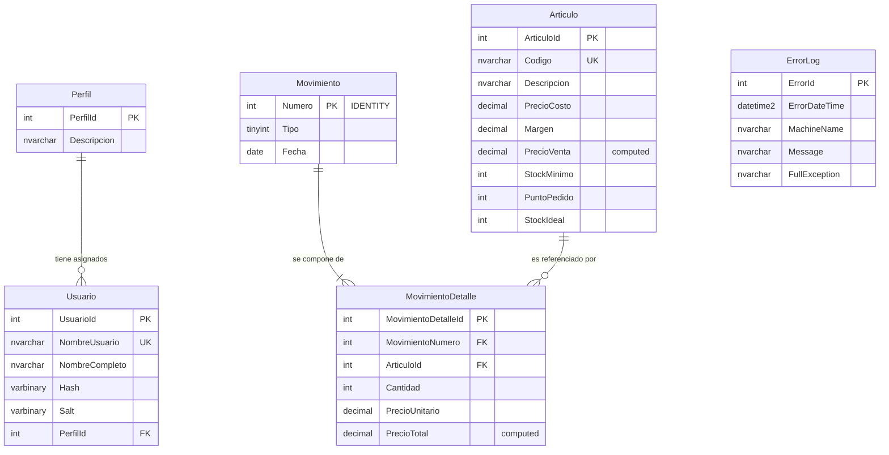

# Modelo de Datos (Fase 1): Módulo de Stock

**Funcionalidad**: [spec.md](./spec.md) | **Plan**: [plan.md](./plan.md) | **Investigación**: [research.md](./research.md)
**Motor**: SQL Server 2017 vía EF Core Migrations

---

## Diagrama de relaciones



`ErrorLog` no tiene relaciones: se escribe desde una conexión independiente para sobrevivir al
rollback de la transacción que falló (R-08).

---

## Entidades

### Perfil

| Campo | Tipo | Restricciones | Requisito |
|-------|------|---------------|-----------|
| `PerfilId` | `int IDENTITY` | PK | RF-001 |
| `Descripcion` | `nvarchar(100)` | NOT NULL | RF-001, RF-003 |

**Reglas**:
- Baja restringida: se rechaza si existen usuarios con este perfil. FK `Usuario.PerfilId` con `ON DELETE NO ACTION`, más verificación previa en el servicio para devolver un error de negocio legible en vez de una violación de FK. — RF-002a

### Usuario

| Campo | Tipo | Restricciones | Requisito |
|-------|------|---------------|-----------|
| `UsuarioId` | `int IDENTITY` | PK | RF-004 |
| `NombreUsuario` | `nvarchar(50)` | NOT NULL, índice único | RF-004, RF-011 |
| `NombreCompleto` | `nvarchar(200)` | NOT NULL | RF-004 |
| `Hash` | `varbinary(32)` | NOT NULL | RF-007 |
| `Salt` | `varbinary(16)` | NOT NULL | RF-008 |
| `PerfilId` | `int` | NOT NULL, FK → `Perfil` | RF-004, RF-010 |

**Reglas**:
- `Hash` y `Salt` son columnas **separadas**, según la forma exigida por el PRD. Derivación PBKDF2-HMAC-SHA256, 210.000 iteraciones, salt aleatorio de 16 bytes por usuario (R-03). — RF-007, RF-008
- La contraseña en claro nunca se persiste ni se registra en logs. Validación de mínimo 8 caracteres alfanuméricos **antes** de derivar el hash. — RF-009
- `Hash`/`Salt` nunca se exponen en ningún DTO de respuesta de la API.

### Artículo

| Campo | Tipo | Restricciones | Requisito |
|-------|------|---------------|-----------|
| `ArticuloId` | `int IDENTITY` | PK (sustituta) | — |
| `Codigo` | `nvarchar(50)` | NOT NULL, índice único | RF-013, RF-017 |
| `Descripcion` | `nvarchar(200)` | NOT NULL, collation `Modern_Spanish_CI_AI` | RF-013, RF-027a |
| `PrecioCosto` | `decimal(18,2)` | NOT NULL, `CHECK >= 0` | RF-013, RF-018 |
| `Margen` | `decimal(9,4)` | NOT NULL, `CHECK >= 0` | RF-013, RF-018 |
| `PrecioVenta` | `decimal(18,2)` | **Columna calculada PERSISTED** | RF-016 |
| `StockMinimo` | `int` | NOT NULL, `CHECK >= 0` | RF-013a, RF-018 |
| `PuntoPedido` | `int` | NOT NULL, `CHECK >= 0` | RF-013a, RF-018 |
| `StockIdeal` | `int` | NOT NULL, `CHECK >= 0` | RF-013a, RF-018 |

**Reglas**:
- Los tres parámetros de reposición son `int`, lo que implementa RF-013a: el Stock Actual y la Cantidad a Pedir resultan enteros por construcción y no hace falta regla de redondeo.
- `PrecioVenta` es columna calculada persistida:
  `PrecioVenta AS CAST(PrecioCosto * (1 + Margen / 100.0) AS decimal(18,2)) PERSISTED`.
  Al calcularla el motor, es imposible que diverja de costo y margen — refuerzo del Principio III. — RF-016
- `CHECK (StockMinimo <= PuntoPedido AND PuntoPedido <= StockIdeal)` a nivel de tabla, más validación en el servicio para el mensaje de error. — RF-019
- Baja restringida: se rechaza si el artículo tiene detalle de movimientos. FK con `ON DELETE NO ACTION` más verificación previa en el servicio. — RF-014a
- La PK es sustituta y no el `Codigo` para que modificar el Código de un artículo (permitido por RF-015) no obligue a propagar el cambio al histórico de movimientos.

**Decisión de redondeo**: el `CAST` a `decimal(18,2)` aplica redondeo de mitad hacia arriba en valor
absoluto, el comportamiento de SQL Server. El spec no fija una regla de redondeo para el Precio de
Venta; se adopta ésta por ser la del motor y se documenta acá para que sea verificable.

### Movimiento (encabezado)

| Campo | Tipo | Restricciones | Requisito |
|-------|------|---------------|-----------|
| `Numero` | `int IDENTITY` | PK | RF-020a |
| `Tipo` | `tinyint` | NOT NULL, `CHECK IN (1,2)` | RF-020b |
| `Fecha` | `date` | NOT NULL | RF-020, RF-020d |

**Reglas**:
- `Numero` es `IDENTITY` y clave primaria: única globalmente, compartida entre compras y ventas, no editable y no reutilizable tras una baja (R-07). — RF-020a
- `Tipo` es un conjunto cerrado: `1 = Compra` (suma al stock), `2 = Venta` (resta). — RF-020b
- `Fecha` no puede ser posterior a la fecha actual; se valida en el servicio, no con `CHECK`, porque la condición depende del momento de evaluación. — RF-020d
- No tiene estados ni transiciones de ciclo de vida: sólo alta, modificación y baja.

### Detalle de movimiento

| Campo | Tipo | Restricciones | Requisito |
|-------|------|---------------|-----------|
| `MovimientoDetalleId` | `int IDENTITY` | PK | — |
| `MovimientoNumero` | `int` | NOT NULL, FK → `Movimiento`, `ON DELETE CASCADE` | RF-021 |
| `ArticuloId` | `int` | NOT NULL, FK → `Articulo`, `ON DELETE NO ACTION` | RF-014a |
| `Cantidad` | `int` | NOT NULL, `CHECK > 0 AND <= 1000000` | RF-023, RF-023a |
| `PrecioUnitario` | `decimal(18,2)` | NOT NULL, `CHECK >= 0` | RF-020 |
| `PrecioTotal` | `decimal(18,2)` | **Columna calculada PERSISTED** | RF-020c |

**Reglas**:
- `PrecioTotal AS CAST(Cantidad * PrecioUnitario AS decimal(18,2)) PERSISTED`: lo calcula el sistema, no el usuario. — RF-020c
- `PrecioUnitario` **no** se valida contra `PrecioCosto` ni `PrecioVenta` del artículo: refleja la operación real. — RF-023b
- El borrado del encabezado arrastra el detalle (`CASCADE`), implementando "baja de encabezado y detalle". — RF-021
- Un movimiento es todo-o-nada: encabezado y todas sus líneas se validan y persisten en una única transacción. — RF-024c

**Índice de rendimiento**:
`IX_MovimientoDetalle_ArticuloId` sobre `(ArticuloId)` con `INCLUDE (Cantidad, MovimientoNumero)`.
Es el índice de cobertura que sostiene la agregación de `vw_StockActual` (R-01).

### Registro de error

| Campo | Tipo | Restricciones | Requisito |
|-------|------|---------------|-----------|
| `ErrorId` | `int IDENTITY` | PK | RF-028 |
| `ErrorDateTime` | `datetime2` | NOT NULL | RF-028 |
| `MachineName` | `nvarchar(100)` | NOT NULL | RF-028 |
| `Message` | `nvarchar(max)` | NOT NULL | RF-028 |
| `FullException` | `nvarchar(max)` | NULL | RF-028 |

**Reglas**:
- Se escribe desde una conexión y un `DbContext` independientes, de modo que el registro sobreviva al rollback de la transacción fallida (R-08). — RF-028, CE-008
- Registra **sólo errores de ejecución no controlados**. Los rechazos de negocio esperados (stock insuficiente, código duplicado, contraseña corta, rango inválido) son resultados previstos y no se registran acá.

---

## Objeto derivado: `vw_StockActual`

Vista que materializa la definición del Stock Actual como saldo de movimientos. Es el **único**
lugar donde se calcula el stock: la consultan las dos consultas de pantalla y también la validación
del invariante. Centralizarla evita que dos implementaciones del saldo diverjan (Principio III).

```sql
CREATE VIEW dbo.vw_StockActual AS
SELECT  a.ArticuloId,
        a.Codigo,
        a.Descripcion,
        ISNULL(SUM(CASE WHEN m.Tipo = 1 THEN d.Cantidad ELSE -d.Cantidad END), 0) AS StockActual
FROM        dbo.Articulo          a
LEFT JOIN   dbo.MovimientoDetalle d ON d.ArticuloId       = a.ArticuloId
LEFT JOIN   dbo.Movimiento        m ON m.Numero           = d.MovimientoNumero
GROUP BY    a.ArticuloId, a.Codigo, a.Descripcion;
```

- El `LEFT JOIN` con `ISNULL(..., 0)` hace que los artículos **sin movimientos** aparezcan con Stock Actual 0 en lugar de desaparecer del resultado. — RF-030
- Se mapea en EF Core como entidad sin clave (`HasNoKey().ToView("vw_StockActual")`).
- No es una vista indexada: ver R-01 para el análisis de rendimiento y las alternativas descartadas.

---

## Reglas de cálculo del pedido (lógica pura, sin base de datos)

Función determinista que opera sobre el resultado de `vw_StockActual` cruzado con los parámetros de
reposición del artículo. Se implementa como función pura para poder desarrollarla test-first sin
infraestructura (R-10).

```
Nivel(modo, art) = modo = HastaStockMinimo → art.StockMinimo
                   modo = HastaPuntoPedido → art.PuntoPedido
                   modo = HastaStockIdeal  → art.StockIdeal

Incluir(soloBajoMinimo, art, stock) = soloBajoMinimo ? (stock < art.StockMinimo) : true

CantidadAPedir(modo, art, stock) = MAX(0, Nivel(modo, art) - stock)
```

- Con `soloBajoMinimo = No` se listan **todos** los artículos, incluidos los de cantidad 0. — RF-026
- Con `soloBajoMinimo = Sí`, `MAX(0, …)` es redundante pero se aplica igual por uniformidad: RF-019 garantiza `StockMinimo ≤ Nivel` y el filtro garantiza `stock < StockMinimo`, por lo que la diferencia siempre es positiva. — RF-026
- Se valida contra el Conjunto de Datos de Referencia del spec, que fija las 36 cantidades esperadas. — CE-003

---

## Orden, filtro y recorte de las consultas

Pipeline común a ambas consultas, en este orden exacto (RF-027b):

1. **Filtrar** por rango de `Codigo` (sólo Consulta de Stock Actual, RF-025a) y por descripción (ambas, RF-027a).
2. **Ordenar** por `Codigo` ascendente.
3. **Recortar** a 10.000 filas.
4. Marcar `Truncado = true` si se alcanzó el tope, para que la UI lo informe (RF-027c).

El orden antes del recorte es lo que hace el resultado determinista y reproducible: sin él, *cuáles*
10.000 filas vuelven quedaría a criterio del plan de ejecución.

**Comparación de cadenas**: el rango sobre `Codigo` usa la collation por defecto de la base
(`Modern_Spanish_CI_AS`), que ordena alfabéticamente como texto según RF-025a. El filtro por
descripción usa la collation `Modern_Spanish_CI_AI` de esa columna, que aporta la insensibilidad a
acentos de RF-027a.

---

## Protocolo de escritura de movimientos (invariante de arquitectura)

Toda ruta que cree, modifique o elimine movimientos **debe** seguir esta secuencia. Es la base de
RF-024a, RF-024b y RF-024c, y su corrección depende de que ninguna ruta la evite.

1. Abrir transacción.
2. `SELECT … FROM Articulo WITH (UPDLOCK, HOLDLOCK) WHERE ArticuloId IN (…) ORDER BY ArticuloId` — bloqueo pesimista en orden ascendente para evitar deadlocks entre movimientos multilínea.
3. Leer el Stock Actual resultante desde `vw_StockActual`, ya dentro de la transacción.
4. Validar `StockActual ≥ 0` para **todos** los artículos afectados; si alguno falla, abortar por completo. — RF-024a, RF-024c
5. Aplicar encabezado y detalle.
6. Confirmar.

Ante concurrencia, la segunda transacción espera, re-lee el saldo ya actualizado y —si no
alcanza— falla con *stock insuficiente*, nunca con un error de conflicto que exija reintento
(RF-024b).

---

## Datos de siembra

Necesarios para que el sistema sea operable en el primer arranque:

- Perfil `administrador` (y, por utilidad, `administrativo` y `vendedor`). — RF-001
- Usuario `admin` con perfil administrador, hash derivado con salt propio. — Supuesto del spec sobre el administrador inicial
- La contraseña inicial se toma de una variable de entorno; no se hardcodea ni se commitea. — Principio IV

---

## Trazabilidad requisito → elemento del modelo

| Requisito | Dónde se implementa |
|-----------|---------------------|
| RF-002a | FK `Usuario.PerfilId` `NO ACTION` + verificación en servicio |
| RF-007, RF-008 | `Usuario.Hash`, `Usuario.Salt` (columnas separadas) |
| RF-013a, RF-018 | Tipos `int` + `CHECK >= 0` en los tres parámetros |
| RF-014a | FK `MovimientoDetalle.ArticuloId` `NO ACTION` + verificación en servicio |
| RF-016 | Columna calculada `Articulo.PrecioVenta` |
| RF-017 | Índice único `Articulo.Codigo` |
| RF-019 | `CHECK` de tabla en `Articulo` |
| RF-020a | `Movimiento.Numero` `IDENTITY` PK |
| RF-020b | `CHECK Tipo IN (1,2)` |
| RF-020c | Columna calculada `MovimientoDetalle.PrecioTotal` |
| RF-020d | Validación de fecha en servicio |
| RF-021 | FK `MovimientoNumero` `ON DELETE CASCADE` |
| RF-023, RF-023a | `CHECK Cantidad > 0 AND <= 1000000` |
| RF-023b | Ausencia deliberada de validación cruzada de precio |
| RF-024a/b/c | Protocolo de escritura de movimientos |
| RF-025a | Rango sobre `Codigo` con collation `CI_AS` |
| RF-026 | Reglas de cálculo del pedido |
| RF-027a | Collation `CI_AI` en `Articulo.Descripcion` |
| RF-027b, RF-027c | Pipeline filtrar → ordenar → recortar → marcar |
| RF-028 | Tabla `ErrorLog` + conexión independiente |
| RF-029 | Sin campo de stock: apertura vía movimientos de Compra |
| RF-030 | `LEFT JOIN` + `ISNULL(…, 0)` en `vw_StockActual` |
| RF-033 | Consulta sin persistencia de resultados |
